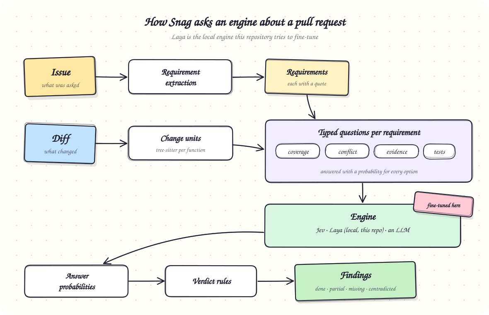

# laya-snag-finetune

**Fine-tuning experiments that tried to turn [Laya](https://github.com/NandhaKishorM/laya), an open typed-decision model, into the local verdict engine for Snag, an AI reviewer that checks whether a pull request does what its issue asked. It includes the code, the audited data and the results, negative ones included.**

> **Status: research, not a product.** After four training runs, one mechanics diagnostic and one controlled experiment, fine-tuned Laya does **not** reliably tell implemented code from missing code on codebases it has never seen. Everything needed to check that claim, reproduce it, or try to beat it is in this repository.

---

## Contents

- [Headline results](#headline-results)
- [What this is](#what-this-is)
- [How Snag uses a typed-decision engine](#how-snag-uses-a-typed-decision-engine)
- [Repository layout](#repository-layout)
- [Quickstart](#quickstart)
- [The data](#the-data)
- [The experiments](#the-experiments)
- [Evaluation rules](#evaluation-rules)
- [What we learned](#what-we-learned)
- [Reproducibility](#reproducibility)
- [Limitations and next steps](#limitations-and-next-steps)
- [Licence and attribution](#licence-and-attribution)

---

## Headline results

The final controlled experiment (E7) used **27 matched pairs**, each the same requirement shown twice: once with its implementing code and once with that code removed. Every pair was scored by a model that **never saw that codebase** (3-fold cross-validation grouped by repository).

| Measured on unseen codebases | Original Laya | Fine-tuned Laya |
|---|---|---|
| Implemented recognised | 25/27 | 14/27 |
| Missing recognised | 0/27 | 13/27 |
| Both halves of a pair right | 0/27 | 4/27 |
| Rates the version without the code as more likely missing | 15/27 | 12/27 (chance level) |
| Fit on its own training pairs | n/a | 38/42 |

**Reading it:** the model can memorise its training codebases (38 of 42 pairs), and the training mechanics are verified separately. But on new code, fine-tuning only moved it from "always implemented" to guessing. Discrimination did not transfer.

Across the whole project, on held-out mutation PRs scored with a strict evaluator and rubric-adjudicated labels, the Laya-backed pipeline caught 4/25 target defects with the correct type. A single Claude Sonnet 5 call per PR plus deterministic checks caught 20/25 (full numbers in [`docs/eval-results-strict.md`](docs/eval-results-strict.md)).

---

## What this is

Snag (working name Remit) reviews a pull request against its linked issue. It extracts requirements, splits the diff into change units, and asks an engine narrow typed questions:

- *Coverage (score):* how much of `requirement.text` do the changed units implement? None, Touched, Most or Full.
- *Conflict (yes/no):* does any change do something different from what the requirement states?
- *Evidence (choice):* which unit most directly implements it?
- *Tests (yes/no):* do the tests assert the stated behaviour, or something different?

Plain code then turns the answer probabilities into verdicts (done, partial, missing, contradicted) and findings.

The intended engine, TypeSafe's Jev, was unavailable (signups paused). **Laya** is an open model built for exactly this interface: a ModernBERT-large encoder (421M parameters) with a head that answers choice, score and yes/no questions with calibrated probabilities. It runs locally and costs nothing per call. This repository records the attempt to make Laya good enough for Snag.

---

## How Snag uses a typed-decision engine

<p align="center">
  
</p>

The engine sees a JSON *state*: the requirement plus candidate change units with their diffs. It answers each question with a probability per option. `scripts/laya/server.py` serves Laya behind the same protocol (`POST /v1/systemone`). It rejects over-long inputs instead of truncating them silently, so Snag shrinks context itself.

---

## Repository layout

```
.
├── README.md                     you are here
├── requirements.txt              pinned Python dependencies (Python 3.12)
├── scripts/laya/                 standalone: run from the repo root
│   ├── base_checkpoint.py        pinned base checkpoint (downloads on first use)
│   ├── server.py                 Jev-compatible local engine (strict window, no silent truncation)
│   ├── mechanics.py              instrumented trainer-mechanics diagnostic (27 hand-written pairs)
│   ├── pairs_experiment.py       E7: controlled experiment, seed-grouped cross-validation
│   ├── build_pairs.py            builds the matched pairs from rubric-audited labels
│   ├── train.py                  full fine-tuning (manifests, resumable checkpoints, per-class metrics)
│   └── shortcut_probe.py         checks whether superficial features predict the labels
├── snag-integration/             need the Snag monorepo (TypeScript pipeline, eval CLI)
│   ├── build-trainset.ts         runs Snag's real pipeline with OracleJev to record training examples
│   ├── oracle.ts                 OracleJev: answers from labels, records label-decided targets
│   ├── adjudications.ts          audited label corrections
│   └── eval-remit-laya.sh, slice-report.mjs, probe-llm-jev.ts
├── training/laya/
│   ├── data/                     OracleJev records and exported train/val sets (gzipped JSONL)
│   ├── pairs/                    checked matched pairs, summary and E7 results
│   ├── mechanics/                the 27 hand-written mechanics examples
│   ├── audit/                    label audits and adjudications (rubric-based)
│   └── STRATEGY-2026-09-27.md    the strategy as reviewed before the later runs
├── docs/
│   ├── status-rubric.md          the written labelling standard
│   ├── eval-results-strict.md    strict evaluation of all engines
│   ├── experiment-log.md         the dated experiment log
│   ├── laya.md                   engine setup notes
│   ├── plan-to-target.md         plan and gates for the 99% acceptance target
│   ├── benchmark-registry.md     public benchmarks, from primary sources
│   └── assets/                   the pipeline diagram (SVG) and its generator
├── logs/                         raw training and experiment logs
└── checkpoints/README.md         model card and checksums (weights are not in git)
```

---

## Quickstart

Tested on Apple Silicon (M5, 24 GB, macOS) with the MPS backend. CUDA and CPU work through PyTorch, but they have not been timed here.

```bash
git clone git@github.com:Adityaakr/laya-snag-finetune.git
cd laya-snag-finetune
python3.12 -m venv .venv && .venv/bin/pip install -r requirements.txt
export HF_HOME="$PWD/.laya/hf"
```

**1. Mechanics diagnostic (about 5 min).** It proves the trainer can learn; it says nothing about quality.

```bash
.venv/bin/python -u scripts/laya/mechanics.py --steps 60 --dtype bf16
# expect: GATE fit PASS (27/27); matched pairs PASS; reload PASS
```

The first run downloads the pinned base checkpoint (about 1 GB) into `.laya/hf`.

**2. Controlled experiment E7 (about 40 min).**

```bash
python3 scripts/laya/build_pairs.py          # byte-identical to the committed pairs.jsonl
.venv/bin/python -u scripts/laya/pairs_experiment.py --stages A --qids coverage --folds 3 --steps 60
# writes training/laya/pairs/results-stageA-coverage-k3-s0.json
```

**3. Full fine-tuning (hours).**

```bash
.venv/bin/python -u scripts/laya/train.py --epochs 2 --accum 8 --checkpointing --name my-run
# resumable: add --resume after an interruption
```

**4. Serve a checkpoint as a Jev-compatible engine.**

```bash
LAYA_DEVICE=mps LAYA_MAX_LEN=4096 LAYA_REMIT_DIR=.laya/my-run .venv/bin/python scripts/laya/server.py
curl -s http://127.0.0.1:8765/health
```

---

## The data

### Source

Snag's **mutation corpus**: 12 small seed repositories (TypeScript, Python, Rust). Each is a correct PR for an issue, and mutation operators derive defective variants from it:
- drop a requirement;
- flip a condition;
- remove one case;
- unwire a call;
- weaken or skip a test;
- inject a config change or a refactor;
- claim everything is done.

Seeds were annotated by Claude Code, not by humans.

### Splits (by repository, before any augmentation)

| Role | Seeds |
|---|---|
| Training (7) | py-blog-slugs, py-csv-import, rs-cli-args, rs-config-parser, ts-flag-rules, ts-job-intervals, ts-money-format |
| Validation (2) | py-retry-backoff, rs-semver-compare |
| Final test (3, frozen, never used here) | py-order-date-ranges, rs-lru-cache, ts-list-pagination |

### How examples are made

`OracleJev` (in `snag-integration/`) runs Snag's real pipeline on each dev item and answers from the labels. It records a training example only when the labels decide the answer, so the recorded states are exactly what Snag would send. Result: `training/laya/data/oracle-records.jsonl.gz` (4,317 records, 3,325 unique).

### The label audit (the most important finding)

Every targeted label across the 9 dev seeds was re-judged against a written rubric ([`docs/status-rubric.md`](docs/status-rubric.md)), from the code and never from the operator's name:

| Operator | Items | Agree | Wrong | Ambiguous |
|---|---|---|---|---|
| drop_requirement | 36 | 20 | 15 (missing, really contradicted) | 1 |
| claim_all_done | 9 | 2 | 6 (missing, really contradicted) | 1 |
| partial_requirement | 9 | 1 | 7 (partial, really contradicted) | 1 |
| unwire | 9 | 0 | 8 (never partial: 5 missing, 3 contradicted) | 1 |
| flip_condition | 20 | 18 | 0 | 2 |
| clean "done" spot-checks | 18 | 18 | 0 | 0 |

**36 of 83 targeted labels (43%) were wrong.** They followed the mutation's name: a dropped requirement was labelled "missing" even when the code still handled the situation with an outcome the requirement rules out. For example, removing exponential backoff leaves a fixed delay, which contradicts "delays double". Earlier training runs learned from these labels. Full evidence, with file and line references: `training/laya/audit/label-audit-all.jsonl`.

### The checked pair set

`training/laya/pairs/pairs.jsonl` holds 141 pairs, each (implemented state, defective state) for the same requirement of the same seed:
- labels come from the rubric audit;
- the 6 ambiguous cases are excluded;
- no synthetic twins, no foreign padding.

Stage A (coverage: done against truly missing) has 27 pairs.

### Other audits

- `label-audit.md`: the first audit. It found twin shortcuts, doubtful flip-test labels and a substring bug in unit matching.
- `mutation-adjudication-2026-09-28.md`: held-out cases judged against the rubric.
- `swebench-gold-*.md`: finding-level adjudication of an LLM reviewer on real SWE-bench Verified gold patches, for reference.

---

## The experiments

| # | What | Result | Decision |
|---|---|---|---|
| v1 | Fine-tune on OracleJev data, top 6 layers, 2 epochs | Held-out question accuracy 43.6% to 82.1%, but end to end on mutation PRs only 1/21 held-out defects caught: it learned the majority answers ("done", "no conflict") | Diagnosed class imbalance |
| v2 | Counterfactual "missing" twins, class balancing | Stopped at step 90/394: two confirmed input shortcuts (distractor ids `D*`, twins with one fewer candidate) and a flat loss | Fixed the shortcuts |
| E1 | Mechanics diagnostic (27 hand-written pairs) | 27/27 fit, matched pairs flip correctly, reload identical: **the trainer works** | Keep the recipe |
| Stage A | Fixed, adjudicated data, 4 core questions | Held-out missing recall 0/43; conflict false positives on 92% of negatives | Paused |
| Audit | Rubric audit of all dev labels | 36/83 targeted labels wrong | Rebuilt the data as checked pairs |
| E7 | Controlled pairs, seed-grouped cross-validation | See [headline results](#headline-results): no transfer to unseen codebases | **Fine-tuning paused** |

Raw logs are in `logs/`, and dated details in [`docs/experiment-log.md`](docs/experiment-log.md).

---

## Evaluation rules

These rules were adopted after mistakes that inflated early numbers:

- **Split by repository, before augmentation.** Twins, padding and paraphrases stay with their source.
- **The frozen test is never used** for training, tuning or selection. The trainer refuses test-seed records.
- **No silent truncation.** Examples that would not fit the window are dropped and counted.
- **Immutable manifests.** Every encoded example has input and target hashes, ancestry and rejection reasons.
- **Shortcut probes.** `shortcut_probe.py` predicts labels from superficial features (candidate count, language mix, lengths). A foreign-unit twin design scored up to +0.30 over the majority baseline; the redesign cut that to about +0.08.
- **Balanced metrics.** Per-class recall and pair-level metrics, not raw accuracy, because a majority-class model looks good on raw accuracy.
- **Fixed budgets.** The E7 checkpoint was not selected on validation results.

---

## What we learned

1. **Check labels before training.** Nearly half the "missing" and "partial" labels were wrong, and no training recipe fixes that.
2. **A model that fits its training data is not a model that has learned.** Mechanics pass (27/27), training pairs fit (38/42), unseen pairs at chance.
3. **Augmentation leaks easily.** Tell-tale ids, candidate counts and cross-language replacement units all gave the answer away until they were probed and removed.
4. **Question-level accuracy misleads.** v1 reached 82% held-out question accuracy while catching 1 of 21 real defects end to end.
5. **In this setup, a strong general model is far ahead.** A single Claude Sonnet 5 review, with deterministic test checks, beats every Laya variant on the same items. That gap is the current ceiling to close.

---

## Reproducibility

| | |
|---|---|
| Base model | `convaiinnovations/laya`, subfolder `typed-decisions`, revision `55cf4c4ebb4ebe31b2550e8bdf3bd21b99753851` (ModernBERT-large, 421,293,830 parameters) |
| Libraries | see `requirements.txt` (laya 0.3.20, torch 2.14.0, transformers 5.17.0) |
| Hardware | Apple M5, 24 GB unified memory, MPS, bf16 autocast |
| Recipe | top 6 of 28 encoder layers plus head trainable; AdamW (encoder 2e-5, head 1e-4); gradient checkpointing; shapes bucketed (lengths to 256, options to 8) so the MPS graph cache stays bounded |
| Timing | about 3.5 s per step on short inputs (focused keys), 40 to 80 s per 8-batch step at 1-4k tokens; E7 about 40 min |
| Checkpoints | not in git (843 MB each); checksums and rebuild steps in `checkpoints/README.md` |

---

## Limitations and next steps

- **Small and synthetic data:** 9 dev seeds, one annotation style. Data quantity is a plausible cause of E7's failure, but no improvement signal justified scaling.
- **Labels are Claude-audited, not human-reviewed.** A human sample check is the next step before any claim.
- **Next, in order:**
  1. relabel the corpus from code (run each requirement's example inputs against the head code);
  2. add many more independent codebases, for example real PRs and PAIChecker's human-labelled SWE-bench alignment data;
  3. retry E7 only then, with a specific hypothesis.
- Otherwise, use Laya only as a cheap pre-filter in front of a stronger model, and measure its routing errors.

---

## Licence and attribution

- **Laya** (base model and library) is © its authors, Apache-2.0: <https://github.com/NandhaKishorM/laya>, <https://huggingface.co/convaiinnovations/laya>. Fine-tuned weights derived from it are not distributed here.
- **ModernBERT-large** (the encoder inside Laya) is by Answer.AI, Apache-2.0.
- **This repository's code and data** come from the Snag project. No licence has been chosen yet; until one is added, all rights are reserved by the author.
